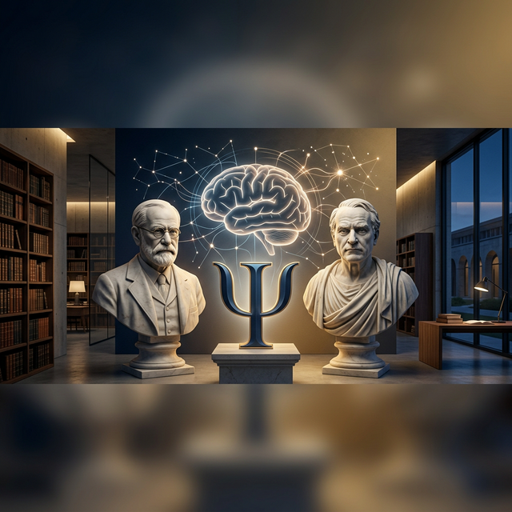

# The-Human-Spec 🧠🔬

> **Project Status:** In-Development (Reverse Engineering Phase)
> **Target System:** Homo Sapiens v2026.03
> **Objective:** Psikoloji disiplinini yapılandırılmış bir sistem dökümantasyonu gibi öğrenmek, insan davranışlarının mimarisini çözümlemek ve bu karmaşık sistemi "herkes için anlaşılır" bir teknik dile tercüme etmek.

## 📌 Vizyon: Neden Teknik Şartname?

Psikoloji, çoğu zaman "soyut" bir kavram olarak algılanır. Ancak insan zihni de belirli girdileri (input) işleyen, belirli algoritmalara göre çıktı (output) üreten ve donanımsal (nörolojik) kısıtları olan muazzam bir sistemdir.

**The-Human-Spec**'in amacı:
- **Öğrenmek:** Karmaşık psikolojik teorileri, bir yazılımcının sistem dökümantasyonunu okuduğu netlikte öğrenmek.
- **Öğretmek:** Kavramları "hardware", "processing", "networking" gibi metaforlarla somutlaştırarak başkalarının da bu sistemi kolayca "debug" etmesini sağlamak.
- **Sistemleştirmek:** Soyut teorileri, neden-sonuç illişkisi içinde mantıksal bir yapıya oturtmak.

---

## 🎓 Learning & Teaching Methodology

Bu proje sadece bir not defteri değil, aynı zamanda bir **Açık Akademi**'dir.

### 🧩 Soyutlamayı Kaybetmeden Somutlaştırma
Her psikolojik olgu, bu repoda bir "teknik modül" olarak ele alınır. 
- Eğer bir **kaygı** (anxiety) durumundan bahsediyorsak, bu bir `Prediction Error` veya `Infinite Loop` olarak analiz edilir. 
- Eğer **öğrenme**den bahsediyorsak, bu bir `Data Ingestion` ve `Cache Optimization` sürecidir.

### 📺 İnteraktif Öğrenme: Premium Dashboard
Öğrenme sürecini görselleştirmek için geliştirilen **[Premium Dashboard](dashboard/index.html)**, projenin "sunum" katmanıdır. Katmanlar arası geçiş yaparak, insan sisteminin modüllerini interaktif bir şekilde inceleyebilir, "boot" sequenceları ile sistemin nasıl ayağa kalktığını simüle edebilirsiniz.

---


## 🏗️ Sistem Mimarisi (Müfredat)

Proje, psikoloji biliminin temel alt dallarını modüler bir yapıda inceler:

### ⚙️ 1. Hardware Layer: Nöro-Psikoloji

Sistemin fiziksel katmanı. İşlemci (Beyin) ve veri yolu (Sinir Sistemi) analizi.

* **Neuro-Transmitters:** Dopamin, Serotonin, Oksitosin (Sistem sinyalleri).
* **Brain Regions:** Amigdala (Güvenlik/Firewall), Prefrontal Korteks (CPU/Mantık Merkezi).
* **Bio-Feedback:** Vücudun zihne gönderdiği "error log"lar.

### 🧠 2. Core Engine: Bilişsel Psikoloji

Bilgi işleme algoritmaları. Veri nasıl içeri alınır ve nasıl saklanır?

* **Attention Filters:** Hangi veri "interrupt" yaratır, hangisi ignore edilir?
* **Memory Management:** RAM (Çalışma belleği) ve Cold Storage (Uzun süreli bellek) optimizasyonu.
* **Decision Algorithms:** Sezgisel (Heuristics) vs. Analitik düşünme modelleri.

### 🔄 3. Lifecycle Management: Gelişim Psikolojisi

Sistemin zaman içindeki versiyon güncellemeleri.

* **Initialization:** Çocukluk evreleri ve temel şemaların (base classes) oluşumu.
* **Update Cycles:** Ergenlik, yetişkinlik ve yaşlılık dönemindeki davranışsal değişiklikler.
* **Legacy Code:** Çocukluktan gelen ve yetişkinlikte "bug" çıkaran kalıplar.

### 📡 4. Network Protocols: Sosyal Psikoloji

Çoklu sistemlerin (Multi-agent systems) birbirleriyle olan etkileşimi.

* **P2P Interaction:** Empati, ayna nöronlar ve sosyal uyum.
* **Social Engineering:** Manipülasyon, ikna ve sosyal etki mekanizmaları.
* **Group Dynamics:** Sürü psikolojisi ve dağıtık sistemlerde karar alma.

### 🛠️ 5. Debugging & Patching: Klinik Psikoloji

Sistem hatalarını giderme ve optimizasyon.

* **Error Handling:** Anksiyete, depresyon ve travma yönetimi.
* **Refactoring:** Bilişsel Davranışçı Terapi (CBT) ile düşünce kalıplarını yeniden yazma.
* **Stability Patches:** Stoacılık, farkındalık (mindfulness) ve öz-düzenleme teknikleri.

### 🏗️ 6. Framework Architects: Ekoller ve İsimler

Sistemin mimari temellerini atan baş mühendisler.

* **Sigmund Freud:** Legacy Kernel (Bilinçaltı), ID/Ego/Superego katmanları.
* **Carl Jung:** Shared Library (Kolektif Bilinçdışı) ve Archetype frameworkleri.
* **B.F. Skinner:** I/O Determinism ve Behaviorism (Davranışçılık) geri bildirim döngüleri.
* **Alfred Adler:** Social Interface (Aşağılık Kompleksi) ve sistem dengeleme.
* **Abraham Maslow:** Priority Scheduling (İhtiyaçlar Hiyerarşisi) ve kaynak yönetimi.
* **Viktor Frankl:** Core Directive (Anlam Arayışı) ve sistem sürekliliği.
* **Carl Rogers:** System Acceptance (Koşulsuz Kabul) ve benlik tutarlılığı.
* **Jean Piaget:** Cognitive Versioning (Gelişim Evreleri) ve Şema mimarisi.

### 🧬 7. Specialized Modules: Özel Alanlar

Belirli senaryolar için özelleşmiş sistem modülleri.

* **Evolutionary Psychology:** Atasal "Legacy Code" ve hayatta kalma optimizasyonları.
* **Cognitive Psychology:** Bilgi işleme (Input-Output) ve bellek yönetimi.
* **Positive Psychology:** Well-being "Buff"ları ve sistem performans optimizasyonu.
* **Existential Psychology:** Root Protocols (Ölüm, Özgürlük, Anlam) ve varoluşsal hata yönetimi.

---

## 📂 Dosya Yapısı

```bash
The-Human-Spec/
├── 01_Hardware/            # Nörobilim ve Biyolojik temeller
├── 02_Processing/          # Bilişsel süreçler (Algı, Bellek, Karar)
├── 03_Versions/            # Gelişimsel evreler ve yaş döngüleri
├── 04_Networking/          # Sosyal dinamikler ve grup davranışları
├── 05_Maintenance/         # Psikolojik sağlığı koruma ve iyileştirme
├── 06_Framework_Architects/ # Büyük isimler ve ekoller
├── 07_Specialized_Modules/  # Evrimsel, Bilişsel, Pozitif psikoloji vb.
├── Case-Studies/           # Milgram, Stanford gibi meşhur deneyler
└── Specs_Glossary.md       # Psikolojik terimlerin teknik sözlüğü

```

---

## 🚀 Katkıda Bulunma (Learning Process)

Bu repo bir **"Learn-in-Public"** projesidir. Her yeni öğrenilen teori, bir `.md` dosyası olarak ilgili klasöre "commit" edilir. Amaç, psikoloji disiplinini bir yazılımcı titizliğiyle, her kavramın neden-sonuç ilişkisini kurarak öğrenmektir.

---

## 🛡️ Uyarı (Disclaimer)

`The-Human-Spec` profesyonel bir tıbbi rehber değildir. Bu, bir mühendisin insan doğasını anlama yolculuğundaki **öğrenme notlarıdır.** Sistemi "hacklemeye" çalışırken lütfen resmi dökümantasyonlara (profesyonel psikologlar/psikiyatrlar) danışın.

---

**"Understand the mind, master the system."**

